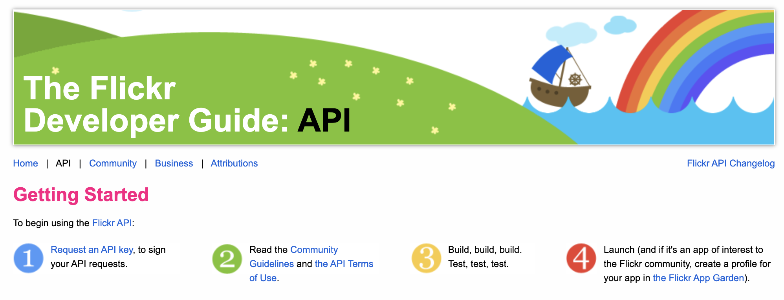

<div align="center">

[](https://flickr.com)

# [Flickr](https://flickr.com)

A subset of Flickr's API defined in Swagger format.

</div>

## Requirements

Building the API client library requires:

1. Java 1.8+
2. Maven (3.8.3+)/Gradle (7.2+)

If you are adding this library to an Android Application or Library:

3. Android 8.0+ (API Level 26+)

## Installation<a id="installation"></a>
<div align="center">
  <a href="https://konfigthis.com/sdk-sign-up?company=Flickr&language=Java">
    
  </a>
</div>

### Maven users

Add this dependency to your project's POM:

```xml
<dependency>
  <groupId>com.konfigthis</groupId>
  <artifactId>flickr-java-sdk</artifactId>
  <version>1.0.0</version>
  <scope>compile</scope>
</dependency>
```

### Gradle users

Add this dependency to your `build.gradle`:

```groovy
// build.gradle
repositories {
  mavenCentral()
}

dependencies {
   implementation "com.konfigthis:flickr-java-sdk:1.0.0"
}
```

### Android users

Make sure your `build.gradle` file as a `minSdk` version of at least 26:
```groovy
// build.gradle
android {
    defaultConfig {
        minSdk 26
    }
}
```

Also make sure your library or application has internet permissions in your `AndroidManifest.xml`:

```xml
<!--AndroidManifest.xml-->
<?xml version="1.0" encoding="utf-8"?>
<manifest xmlns:android="http://schemas.android.com/apk/res/android"
    xmlns:tools="http://schemas.android.com/tools">
    <uses-permission android:name="android.permission.INTERNET"/>
</manifest>
```

### Others

At first generate the JAR by executing:

```shell
mvn clean package
```

Then manually install the following JARs:

* `target/flickr-java-sdk-1.0.0.jar`
* `target/lib/*.jar`

## Getting Started

Please follow the [installation](#installation) instruction and execute the following Java code:

```java
import com.konfigthis.client.ApiClient;
import com.konfigthis.client.ApiException;
import com.konfigthis.client.ApiResponse;
import com.konfigthis.client.Flickr;
import com.konfigthis.client.Configuration;
import com.konfigthis.client.model.*;
import com.konfigthis.client.api.PublicApi;
import java.util.List;
import java.util.Map;
import java.util.UUID;

public class Example {
  public static void main(String[] args) {
    Configuration configuration = new Configuration();
    configuration.host = "https://api.flickr.com/services";
    Flickr client = new Flickr(configuration);
    String apiKey = "apiKey_example";
    String photoId = "photoId_example";
    String groupId = "groupId_example";
    try {
      PublicFlickrGroupsPoolsGetContextResponse result = client
              .public
              .flickrGroupsPoolsGetContext(apiKey, photoId)
              .groupId(groupId)
              .execute();
      System.out.println(result);
      System.out.println(result.getCount());
      System.out.println(result.getNextphoto());
      System.out.println(result.getPrevphoto());
      System.out.println(result.getStat());
    } catch (ApiException e) {
      System.err.println("Exception when calling PublicApi#flickrGroupsPoolsGetContext");
      System.err.println("Status code: " + e.getStatusCode());
      System.err.println("Reason: " + e.getResponseBody());
      System.err.println("Response headers: " + e.getResponseHeaders());
      e.printStackTrace();
    }

    // Use .executeWithHttpInfo() to retrieve HTTP Status Code, Headers and Request
    try {
      ApiResponse<PublicFlickrGroupsPoolsGetContextResponse> response = client
              .public
              .flickrGroupsPoolsGetContext(apiKey, photoId)
              .groupId(groupId)
              .executeWithHttpInfo();
      System.out.println(response.getResponseBody());
      System.out.println(response.getResponseHeaders());
      System.out.println(response.getStatusCode());
      System.out.println(response.getRoundTripTime());
      System.out.println(response.getRequest());
    } catch (ApiException e) {
      System.err.println("Exception when calling PublicApi#flickrGroupsPoolsGetContext");
      System.err.println("Status code: " + e.getStatusCode());
      System.err.println("Reason: " + e.getResponseBody());
      System.err.println("Response headers: " + e.getResponseHeaders());
      e.printStackTrace();
    }
  }
}

```

## Documentation for API Endpoints

All URIs are relative to *https://api.flickr.com/services*

Class | Method | HTTP request | Description
------------ | ------------- | ------------- | -------------
*PublicApi* | [**flickrGroupsPoolsGetContext**](docs/PublicApi.md#flickrGroupsPoolsGetContext) | **GET** /rest?method&#x3D;flickr.groups.pools.getContext | 
*PublicApi* | [**getAccessToken**](docs/PublicApi.md#getAccessToken) | **GET** /oauth/access_token | 
*PublicApi* | [**getAlbumPhotos**](docs/PublicApi.md#getAlbumPhotos) | **GET** /rest?method&#x3D;flickr.photosets.getPhotos | 
*PublicApi* | [**getFavoritePhotos**](docs/PublicApi.md#getFavoritePhotos) | **GET** /rest?method&#x3D;flickr.favorites.getList | 
*PublicApi* | [**getFavoritesContext**](docs/PublicApi.md#getFavoritesContext) | **GET** /rest?method&#x3D;flickr.favorites.getContext | 
*PublicApi* | [**getFlickrTestEcho**](docs/PublicApi.md#getFlickrTestEcho) | **GET** /rest?method&#x3D;flickr.test.echo | 
*PublicApi* | [**getGalleryPhotos**](docs/PublicApi.md#getGalleryPhotos) | **GET** /rest?method&#x3D;flickr.galleries.getPhotos | 
*PublicApi* | [**getGroupDiscussionTopics**](docs/PublicApi.md#getGroupDiscussionTopics) | **GET** /rest?method&#x3D;flickr.groups.discuss.topics.getList | 
*PublicApi* | [**getGroupInfo**](docs/PublicApi.md#getGroupInfo) | **GET** /rest?method&#x3D;flickr.groups.getInfo | 
*PublicApi* | [**getGroupPoolPhotos**](docs/PublicApi.md#getGroupPoolPhotos) | **GET** /rest?method&#x3D;flickr.groups.pools.getPhotos | 
*PublicApi* | [**getGroupTopicInfo**](docs/PublicApi.md#getGroupTopicInfo) | **GET** /rest?method&#x3D;flickr.groups.discuss.topics.getInfo | 
*PublicApi* | [**getGroupTopicRepliesInfo**](docs/PublicApi.md#getGroupTopicRepliesInfo) | **GET** /rest?method&#x3D;flickr.groups.discuss.replies.getInfo | 
*PublicApi* | [**getOAuthToken**](docs/PublicApi.md#getOAuthToken) | **GET** /oauth/request_token | 
*PublicApi* | [**getPersonInformation**](docs/PublicApi.md#getPersonInformation) | **GET** /rest?method&#x3D;flickr.people.getInfo | 
*PublicApi* | [**getPhotoExif**](docs/PublicApi.md#getPhotoExif) | **GET** /rest?method&#x3D;flickr.photos.getExif | 
*PublicApi* | [**getPhotoInfo**](docs/PublicApi.md#getPhotoInfo) | **GET** /rest?method&#x3D;flickr.photos.getInfo | 
*PublicApi* | [**getPhotoLicenses**](docs/PublicApi.md#getPhotoLicenses) | **GET** /rest?method&#x3D;flickr.photos.licenses.getInfo | 
*PublicApi* | [**getPhotoListContext**](docs/PublicApi.md#getPhotoListContext) | **GET** /rest?method&#x3D;flickr.photolist.getContext | 
*PublicApi* | [**getPhotoSetContext**](docs/PublicApi.md#getPhotoSetContext) | **GET** /rest?method&#x3D;flickr.photosets.getContext | 
*PublicApi* | [**getPhotoSizes**](docs/PublicApi.md#getPhotoSizes) | **GET** /rest?method&#x3D;flickr.photos.getSizes | 
*PublicApi* | [**getPhotostreamContext**](docs/PublicApi.md#getPhotostreamContext) | **GET** /rest?method&#x3D;flickr.photos.getContext | 
*PublicApi* | [**getUserAlbums**](docs/PublicApi.md#getUserAlbums) | **GET** /rest?method&#x3D;flickr.photosets.getList | 
*PublicApi* | [**getUserPhotos**](docs/PublicApi.md#getUserPhotos) | **GET** /rest?method&#x3D;flickr.people.getPhotos | 
*PublicApi* | [**searchPhotos**](docs/PublicApi.md#searchPhotos) | **GET** /rest?method&#x3D;flickr.photos.search | 
*PublicApi* | [**uploadPhoto**](docs/PublicApi.md#uploadPhoto) | **POST** /upload | 


## Documentation for Models

 - [Album](docs/Album.md)
 - [ContextPhoto](docs/ContextPhoto.md)
 - [ContextPhotos](docs/ContextPhotos.md)
 - [Cover](docs/Cover.md)
 - [Group](docs/Group.md)
 - [GroupBlast](docs/GroupBlast.md)
 - [GroupDescription](docs/GroupDescription.md)
 - [GroupRestrictions](docs/GroupRestrictions.md)
 - [GroupRoles](docs/GroupRoles.md)
 - [GroupThrottle](docs/GroupThrottle.md)
 - [Note](docs/Note.md)
 - [Owner](docs/Owner.md)
 - [Person](docs/Person.md)
 - [PersonPhotos](docs/PersonPhotos.md)
 - [PersonTimezone](docs/PersonTimezone.md)
 - [Photo](docs/Photo.md)
 - [PhotoDates](docs/PhotoDates.md)
 - [PhotoEditability](docs/PhotoEditability.md)
 - [PhotoNotes](docs/PhotoNotes.md)
 - [PhotoPeople](docs/PhotoPeople.md)
 - [PhotoPermissions](docs/PhotoPermissions.md)
 - [PhotoTags](docs/PhotoTags.md)
 - [PhotoURLs](docs/PhotoURLs.md)
 - [PhotoUrls](docs/PhotoUrls.md)
 - [PhotoUsage](docs/PhotoUsage.md)
 - [PhotoVisibility](docs/PhotoVisibility.md)
 - [PublicFlickrGroupsPoolsGetContextResponse](docs/PublicFlickrGroupsPoolsGetContextResponse.md)
 - [PublicGetAlbumPhotosResponse](docs/PublicGetAlbumPhotosResponse.md)
 - [PublicGetFavoritePhotosResponse](docs/PublicGetFavoritePhotosResponse.md)
 - [PublicGetFavoritesContextResponse](docs/PublicGetFavoritesContextResponse.md)
 - [PublicGetFlickrTestEchoResponse](docs/PublicGetFlickrTestEchoResponse.md)
 - [PublicGetGalleryPhotosResponse](docs/PublicGetGalleryPhotosResponse.md)
 - [PublicGetGroupDiscussionTopicsResponse](docs/PublicGetGroupDiscussionTopicsResponse.md)
 - [PublicGetGroupInfoResponse](docs/PublicGetGroupInfoResponse.md)
 - [PublicGetGroupPoolPhotosResponse](docs/PublicGetGroupPoolPhotosResponse.md)
 - [PublicGetGroupTopicInfoResponse](docs/PublicGetGroupTopicInfoResponse.md)
 - [PublicGetGroupTopicRepliesInfoResponse](docs/PublicGetGroupTopicRepliesInfoResponse.md)
 - [PublicGetPersonInformationResponse](docs/PublicGetPersonInformationResponse.md)
 - [PublicGetPhotoExifResponse](docs/PublicGetPhotoExifResponse.md)
 - [PublicGetPhotoExifResponsePhoto](docs/PublicGetPhotoExifResponsePhoto.md)
 - [PublicGetPhotoExifResponsePhotoExifInner](docs/PublicGetPhotoExifResponsePhotoExifInner.md)
 - [PublicGetPhotoInfoResponse](docs/PublicGetPhotoInfoResponse.md)
 - [PublicGetPhotoLicensesResponse](docs/PublicGetPhotoLicensesResponse.md)
 - [PublicGetPhotoLicensesResponseLicenses](docs/PublicGetPhotoLicensesResponseLicenses.md)
 - [PublicGetPhotoLicensesResponseLicensesLicenseInner](docs/PublicGetPhotoLicensesResponseLicensesLicenseInner.md)
 - [PublicGetPhotoListContextResponse](docs/PublicGetPhotoListContextResponse.md)
 - [PublicGetPhotoSetContextResponse](docs/PublicGetPhotoSetContextResponse.md)
 - [PublicGetPhotoSizesResponse](docs/PublicGetPhotoSizesResponse.md)
 - [PublicGetPhotoSizesResponseSizes](docs/PublicGetPhotoSizesResponseSizes.md)
 - [PublicGetPhotostreamContextResponse](docs/PublicGetPhotostreamContextResponse.md)
 - [PublicGetUserAlbumsResponse](docs/PublicGetUserAlbumsResponse.md)
 - [PublicGetUserPhotosResponse](docs/PublicGetUserPhotosResponse.md)
 - [PublicSearchPhotosResponse](docs/PublicSearchPhotosResponse.md)
 - [PublicUploadPhotoRequest](docs/PublicUploadPhotoRequest.md)
 - [Size](docs/Size.md)
 - [Tag](docs/Tag.md)
 - [Topic](docs/Topic.md)
 - [TopicReply](docs/TopicReply.md)
 - [URL](docs/URL.md)


## Author
This Java package is automatically generated by [Konfig](https://konfigthis.com)
